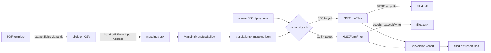

# Manyfest Conversion

A suite of tools for describing how JSON platform payloads map onto fillable PDF forms and Excel spreadsheets, and for actually performing those fills from the command line or from your own code.

These tools are built to be usable from the command line, as Fable services inside your own applications, or both. This module presents these behaviors as a suite of externally usable Fable services and a command-line utility (`mfconv`) to drive them.

## What is a Mapping Manyfest?

A **mapping manyfest** is a standard [Manyfest](https://github.com/stevenvelozo/manyfest) schema whose descriptors describe, for one target form, which JSON source address feeds which PDF field or Excel cell. Descriptors carry the target metadata (field name, field type, cell range) as custom keys so a single file captures everything needed to fill that form from a platform payload.

```json
{
  "Scope": "Bookstore::AcquisitionOrder.pdf",
  "SourceRootAddress": "OrderData",
  "TargetFile": "AcquisitionOrder.pdf",
  "TargetFileType": "PDF",
  "SourceDocumentType": "Bookstore-Acquisition",
  "Descriptors":
  {
    "Header.PONumber":
    {
      "Name": "PO Number",
      "TargetFieldName": "po_number",
      "TargetFieldType": "Text"
    },
    "LineItems[0].Title":
    {
      "Name": "Line 1 Title",
      "TargetFieldName": "line1_title",
      "TargetFieldType": "Text"
    }
  }
}
```

A single file per target form contains everything the filler needs: the source document type to route on, the relative source addresses that feed each field, the target field names, and the target field types.

## Installation

```shell
npm install manyfest-conversion
```

Or for CLI usage:

```shell
npx manyfest-conversion --help
```

The `mfconv` alias is identical and is what the documentation uses.

### External requirement: `pdftk`

PDF filling shells out to the `pdftk` binary (or `pdftk-java`). Install it first:

```shell
brew install pdftk-java          # macOS
apt  install pdftk               # Debian / Ubuntu
```

XLSX filling has no external dependencies.

## Quick Start

### 1. Build mapping manyfests from a CSV

```shell
mfconv build-mappings -i ./mappings.csv -o ./translations
```

The CSV describes one row per target field, grouped by target file. The command writes one `.mapping.json` per distinct target form into the output directory and logs a summary of mapped / unmapped field counts per form.

### 2. Fill a PDF form

```shell
mfconv fill-pdf \
  -m ./translations/AcquisitionOrder.pdf.mapping.json \
  -s ./orders/PO-2026-0001.json \
  -t ./templates/AcquisitionOrder.pdf \
  -o ./filled/PO-2026-0001.pdf
```

Writes the filled PDF plus a sidecar `PO-2026-0001.pdf.report.json` with every success, warning, and error.

### 3. Fill an Excel workbook

```shell
mfconv fill-xlsx \
  -m ./translations/InventorySheet.xlsx.mapping.json \
  -s ./inventory/snapshot-2026-04-08.json \
  -t ./templates/InventorySheet.xlsx \
  -o ./filled/inventory-2026-04-08.xlsx
```

Styles, fonts, borders, merged cells, and sheet themes are preserved on the round-trip (the filler uses `exceljs`, not the SheetJS community edition, specifically for this).

### 4. Batch everything

```shell
mfconv convert-batch \
  -m ./translations \
  -s ./sources \
  -t ./templates \
  -o ./output
```

`convert-batch` routes every source JSON to every mapping whose `SourceDocumentType` matches its `ReportData.DocumentType` and writes filled artifacts plus sidecar reports into the output tree.

## How It Works



The builder consumes a flat CSV and emits one mapping manyfest per target form. The two filler services consume those mapping manyfests plus source JSON payloads and produce filled artifacts. Every fill writes a sidecar report alongside the artifact capturing the outcome at the per-field level.

Every stage is a Fable service. The CLI (`mfconv`) is a thin `pict-service-commandlineutility` wrapper that instantiates the services and calls their public methods. You can skip the CLI and drive the services directly from your own Node code.

## Features

- **PDF → Skeleton CSV** -- extract every fillable field from an existing PDF (via `pdftk dump_data_fields`) and emit a ready-to-edit mapping CSV so you never have to hand-enumerate form fields
- **CSV → Mapping Manyfest** -- bootstrap one mapping manyfest per target form from a single flat CSV
- **Unmapped target tracking** -- CSV rows with no source address are still recorded as `UnmappedTargetFields` so authors can see what remains to be mapped
- **Configurable source root** -- every mapping carries a `SourceRootAddress` (e.g. `ReportData.FormData`) that is prepended to each descriptor address at resolution time
- **PDF form filling** -- via `pdftk` and XFDF, with XML-safe escaping and warn-and-skip for checkbox/Button fields
- **Excel filling with formatting preserved** -- backed by `exceljs`, so fonts, borders, merged cells, and themes survive the fill
- **Cell range expansion** -- target field names like `'Sheet'!O14-25` or `'Sheet'!A1:D5` expand to per-cell writes
- **Array broadcast** -- source addresses like `LineItems[].Price` pull a column out of an array of objects and pair element-by-element with a target cell range
- **Sidecar reports** -- every fill writes a companion JSON with every success, warning, and error so data-quality gaps are visible, not silent
- **Batch conversion** -- one command routes a folder of source JSONs to every matching mapping manyfest and writes the whole output tree

## Next Steps

- [Overview](overview.md) -- full feature tour and when to use each command
- [Quick Start](quickstart.md) -- step-by-step walkthrough with a bookstore example
- [Architecture](architecture.md) -- system design with mermaid diagrams
- [Implementation Reference](implementation-reference.md) -- service-level API reference
- [CLI Reference](cli/overview.md) -- every command with options and examples
- [Mapping Manyfest Format](mapping-manyfest-format.md) -- the schema, descriptor keys, and address syntax
- [Sidecar Reports](sidecar-reports.md) -- reading the per-fill JSON output
- [Examples](examples/README.md) -- runnable bookstore, library catalog, and IRS W-9 walkthroughs

## Related Packages

- [manyfest](https://github.com/stevenvelozo/manyfest) -- JSON object manifest for data description and parsing
- [fable](https://github.com/stevenvelozo/fable) -- Service dependency injection framework
- [pict-service-commandlineutility](https://github.com/stevenvelozo/pict-service-commandlineutility) -- CLI framework used by `mfconv`
- [meadow-integration](https://github.com/stevenvelozo/meadow-integration) -- Sibling data-integration toolkit for Meadow entities
