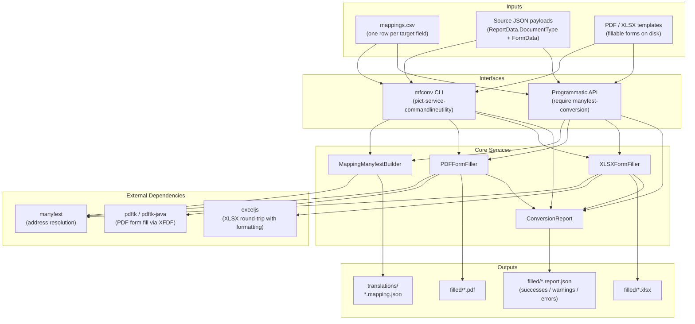
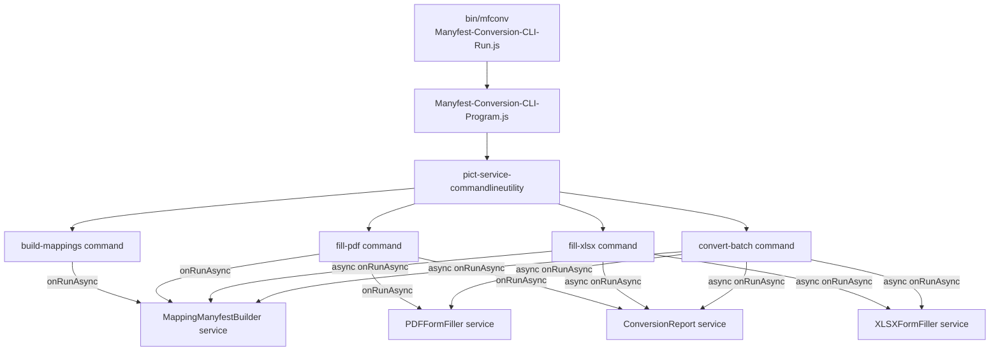

# Architecture

This document describes the architectural design of Manyfest Conversion: the core services, how they relate, the data that flows between them, and how the CLI layer drives the pipeline.

## High-level system diagram

Manyfest Conversion sits between a flat CSV of field mappings (authored by a domain expert) and a set of platform JSON payloads on one side, and a set of fillable form templates on the other. It produces filled artifacts and per-fill sidecar reports.



The system divides into two conceptual phases:

1. **Authoring phase** -- the CSV of field mappings is consumed by `MappingManyfestBuilder` to produce one `.mapping.json` file per target form. This is typically done once per CSV revision, and the output is checked into version control.
2. **Fill phase** -- for each (source JSON, mapping manyfest, template file) triple, the appropriate filler service produces a filled artifact and a sidecar report.

The two phases use completely different services. The authoring phase never touches PDFs or Excel files; the fill phase never touches the CSV. They are joined only by the mapping manyfest files on disk, which is what makes the pipeline easy to audit, diff, and reproduce.

## Authoring pipeline

```mermaid
flowchart LR
    PDFTemplate[PDF template\nwith fillable fields] -->|extract-fields\nvia pdftk dump_data_fields| SkeletonCSV[skeleton CSV\n Form Input Address empty]
    SkeletonCSV -->|hand-edit| CSV[mappings.csv]
    CSV --> Parser[fable CSVParser]
    Parser --> Rows[Header-keyed row objects]
    Rows --> Grouper[Group by PDF File column]
    Grouper --> Builder[MappingManyfestBuilder.applyRowToConfigs]

    Builder -->|has Form Input Address| Descriptor[Add descriptor]
    Builder -->|empty Form Input Address| Unmapped[Append to UnmappedTargetFields]

    Descriptor --> Normalize[Normalize address\nCAGTable[0]CAGB -> CAGTable[0].CAGB]
    Normalize --> Config[Mapping manyfest config object]
    Unmapped --> Config

    Config --> Writer[writeManyfestsToDirectory]
    Writer --> Files[translations/*.mapping.json]

    Config --> Instantiate[instantiateManyfests]
    Instantiate --> Live[Live Manyfest instance]
```

Key steps:

1. **Streaming parse.** The builder uses the Fable `CSVParser` service, which handles quoted fields with embedded commas and multi-line quoted values. Every accepted row is a plain object keyed by the CSV header names.

2. **Group by target file.** Rows are accumulated into a map keyed by the `PDF File` column (the column is named "PDF File" even though it also carries XLSX target filenames). The first time a new target filename is seen, the builder materializes a new manifest config with metadata derived from the row (`TargetFile`, `TargetFileType`, `SourceDocumentType`, `SourceRootAddress`).

3. **Address normalization.** The sample CSV convention `CAGTable[0]CAGB` (no dot between bracket and next property) is rewritten to `CAGTable[0].CAGB` before being stored. This is the only form manyfest's address parser can resolve.

4. **Mapped vs unmapped rows.** Rows with a non-empty `Form Input Address` become descriptors. Rows with an empty `Form Input Address` are recorded on a separate `UnmappedTargetFields` array on the same manifest -- surfacing which target fields exist in the form but haven't been wired to a source yet.

5. **Write-out.** `writeManyfestsToDirectory` serializes each config to `<sanitized-target-file>.mapping.json`. A separate `build-report.json` is written alongside summarising the build (counts, skip reasons).

## Fill pipeline

```mermaid
flowchart LR
    Mapping[mapping.json] --> Load[loadMappingManyfestFromFile]
    Source[source.json] --> ReadSource[Read + parse JSON]

    Load --> Manyfest[Live Manyfest instance]
    ReadSource --> Data[Source data object]

    Manyfest --> Filler{Filler selection}
    Data --> Filler

    Filler -->|TargetFileType=PDF| BuildXFDF[PDFFormFiller.buildXFDF]
    Filler -->|TargetFileType=XLSX| LoadWB[exceljs readFile]

    BuildXFDF --> XFDF[XFDF document]
    XFDF --> PDFTK[pdftk fill_form]
    PDFTK --> OutPDF[filled.pdf]

    LoadWB --> IterDesc[Iterate descriptors]
    IterDesc --> Resolve[resolveSourceValue]
    Resolve -->|scalar| WriteCell[writeCellValue]
    Resolve -->|array with [] + range target| BroadcastLoop[Pair elements with cells]
    BroadcastLoop --> WriteCell
    WriteCell --> SaveWB[exceljs writeFile]
    SaveWB --> OutXLSX[filled.xlsx]

    OutPDF --> Report[ConversionReport.finalize]
    OutXLSX --> Report
    Report --> Sidecar[filled.ext.report.json]
```

Key steps shared by both fillers:

1. **Load mapping manyfest.** `MappingManyfestBuilder.loadMappingManyfestFromFile` parses the JSON from disk and hydrates a live `Manyfest` instance, reattaching the top-level metadata (`SourceRootAddress`, `TargetFile`, `TargetFileType`, `SourceDocumentType`, `UnmappedTargetFields`) to the instance's `manifest` object.

2. **Join the source root.** For every descriptor, the full resolution address is `<SourceRootAddress>.<descriptor key>`. The fill-pdf and fill-xlsx CLI commands take an optional `--source-root` flag to override the mapping's stored root at runtime without touching the file.

3. **Resolve the source value.** Each filler calls the same `resolveSourceValue` helper (on XLSX) or an inline equivalent (on PDF) that handles four outcomes:
   - `scalar` -- a non-null primitive value; write it
   - `array` -- the address contained `[]`, resolved to an array; iterate
   - `missing` -- the address resolved to `null` or `undefined`; warn and continue
   - `error` -- the address could not be resolved at all, or resolved to a non-scalar non-array; error and continue

4. **Write the value.** PDF writes to an XFDF document; XLSX writes directly to an exceljs `Cell`. Neither filler fails the whole fill on a single-field error -- the error is recorded and the loop continues.

5. **Finalize the report.** After the filler writes the output file, it calls `ConversionReport.finalize` to recompute the `Stats` block and then `ConversionReport.writeSidecar` to serialize the report next to the filled artifact.

## PDF fill: XFDF + pdftk

The PDF filler never touches the PDF file directly. Instead it builds an XFDF (XML Forms Data Format) document containing a `<field>` entry per descriptor, writes the XFDF to a temp file, and shells out to `pdftk`:

```text
pdftk <template.pdf> fill_form <temp.xfdf> output <output.pdf>
```

XFDF was chosen over FDF because the sample payloads contain characters (`&`, `<`, quotes, non-ASCII) that are error-prone to escape in FDF. XFDF handles them with standard XML escaping.

The `runPDFTK` helper invokes pdftk with `execFile` (not `exec`), so filenames can never be interpreted as shell arguments. Temp XFDF files are cleaned up in a `finally` block.

**Checkbox / Button fields** are currently warn-and-skip in v1. The XFDF output does not include them and the sidecar report records a warning per skipped checkbox. Checkbox fills require a separate state-matrix convention that is out of scope for the current release.

## XLSX fill: exceljs (not SheetJS)

The XLSX filler uses `exceljs` specifically because the SheetJS community edition does not round-trip most of a workbook's formatting metadata (themes, conditional formats, drawings, charts, some style metadata). The SheetJS paid edition does preserve more, but exceljs is MIT-licensed and sufficient for this use case.

The fill procedure is:

1. `new ExcelJS.Workbook()` and `await wb.xlsx.readFile(templatePath)` -- reads the entire workbook including all styles, merged cells, defined names, and multiple worksheets.
2. For each descriptor, resolve the target sheet + cell addresses via `parseTargetCellSpec`, then resolve the source value via `resolveSourceValue`, then write each value with `worksheet.getCell(address).value = String(value)`.
3. Setting `cell.value` on an exceljs `Cell` object preserves the cell's existing style metadata by design. This is the key reason exceljs was chosen.
4. `await wb.xlsx.writeFile(outputPath)` -- writes the modified workbook.

**Array broadcast** is implemented as a special case in the XLSX filler. When a descriptor's resolved source is an array (because its address contained `[]`) and its target is a multi-cell range (because `expandCellRange` returned more than one cell), the filler pairs each array element with the corresponding cell by index. Size mismatches produce warnings on the sidecar.

## Service composition

All four services extend `fable-serviceproviderbase` and follow the retold ecosystem's DI pattern:

```javascript
const tmpFable = new libPict();
tmpFable.addServiceType('MappingManyfestBuilder', libMappingManyfestBuilder);
tmpFable.addServiceType('PDFFormFiller',          libPDFFormFiller);
tmpFable.addServiceType('XLSXFormFiller',         libXLSXFormFiller);
tmpFable.addServiceType('ConversionReport',       libConversionReport);

tmpFable.instantiateServiceProvider('CSVParser');  // built-in fable service
tmpFable.instantiateServiceProvider('FilePersistence');

const tmpBuilder  = tmpFable.instantiateServiceProvider('MappingManyfestBuilder');
const tmpPDF      = tmpFable.instantiateServiceProvider('PDFFormFiller');
const tmpXLSX     = tmpFable.instantiateServiceProvider('XLSXFormFiller');
const tmpReporter = tmpFable.instantiateServiceProvider('ConversionReport');
```

This is exactly what the CLI commands do under the hood -- `addAndInstantiateServiceTypeIfNotExists` is called on the Fable instance at the start of each command's `onRunAsync`, so service state is scoped to a single CLI invocation and cannot leak between commands.

## CLI composition



Each command is a class extending `pict-service-commandlineutility`'s `ServiceCommandLineCommand` base. Each class declares its keyword, aliases, arguments, and options in its constructor via `this.addCommand()`, and implements `onRunAsync(fCallback)` to do the work.

The `fill-xlsx` and `convert-batch` commands use `async onRunAsync` because `XLSXFormFiller.fillXLSX` returns a Promise (`exceljs` is async). The `build-mappings` and `fill-pdf` commands are synchronous.

## Exit code contract

- **`0`** -- clean run, no errors on any sidecar
- **`1`** -- usage error, missing input file, or unrecoverable CLI problem
- **`2`** -- fill completed but one or more sidecar reports contain errors (`ErrorCount > 0`)

Warnings alone never fail the exit. This is a deliberate contract: the goal of the tool is to produce **a partial artifact plus a sidecar report** that the operator can inspect, not to bail out on the first data-quality hiccup.

## What the pipeline does NOT do

- **No rendering.** The pipeline does not render a PDF or an Excel file from scratch. It requires a pre-existing template with fillable form fields (PDF) or a well-structured worksheet (XLSX).
- **No schema inference.** The builder does not try to guess the source JSON shape. The CSV is authored by a domain expert; the builder only translates it.
- **No checkbox fills in v1.** Button / checkbox fields in PDFs are warn-and-skip. This is by design for the first release; see the overview for the reasoning.
- **No formula recomputation in XLSX.** The filler writes scalar cell values; it does not drive Excel's calculation engine. Formulas in the template are preserved but not forced to recompute until a human opens the workbook.
- **No data validation against the source schema.** The builder produces a mapping manyfest that happens to be a valid Manyfest schema, but the fill services do not call `manifest.validate()` on the source data before filling. Missing values become sidecar warnings; type mismatches are not currently checked.

These are intentional scope boundaries for v1. See the overview for the rationale and for ideas on how each of these could be extended.
